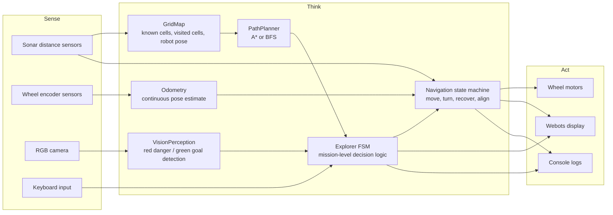
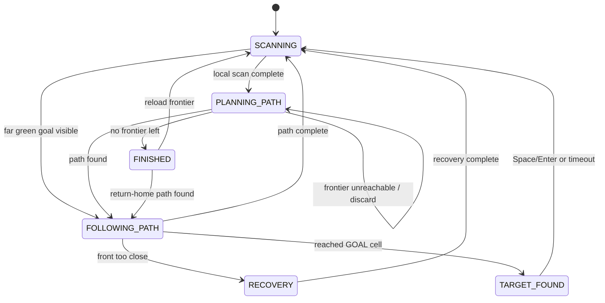

# SSAR Webots — Scout Search and Rescue Robot

SSAR Webots is a Webots simulation project for an autonomous Pioneer 3AT search-and-rescue robot named **Scout**. The robot explores a generated maze, builds a discrete grid map from sonar readings, plans paths through known safe cells, uses camera-based colour perception to detect danger and goal markers, and displays its current map and mission status on a Webots display.

The project is designed for the **Programming for Robotics Final Group Project** under the **Autonomous Robotics (Webots)** specialisation. It demonstrates navigation, obstacle avoidance, perception-driven decision-making, finite-state control, safety recovery, and modular Sense–Think–Act architecture.

---

## Table of contents

- [Project overview](#project-overview)
- [Key features](#key-features)
- [Technical requirements mapping](#technical-requirements-mapping)
- [Repository structure](#repository-structure)
- [System architecture](#system-architecture)
- [Runtime behaviour](#runtime-behaviour)
- [Finite-state machine](#finite-state-machine)
- [Navigation phases](#navigation-phases)
- [Perception system](#perception-system)
- [Mapping and path planning](#mapping-and-path-planning)
- [Safety and robustness](#safety-and-robustness)
- [World generation](#world-generation)
- [Display legend](#display-legend)
- [Keyboard controls](#keyboard-controls)
- [Setup and running](#setup-and-running)
- [Configuration](#configuration)
- [Debugging](#debugging)
- [Known limitations](#known-limitations)
- [Summary](#one-sentence-summary)

---

## Project overview

Scout operates in a generated Webots maze containing:

- grey physical wall blocks
- open traversable cells
- red semantic danger markers
- green semantic goal markers
- one Pioneer 3AT robot with sonar sensors, wheel encoders, a camera, and a display

The robot does not simply drive randomly. It uses a structured loop:

1. **Sense** nearby cells with sonar and colour markers with the camera.
2. **Think** using an exploration finite-state machine, grid memory, frontier selection, and A* path planning.
3. **Act** through differential wheel motor commands, recovery manoeuvres, alignment corrections, and display updates.

The system is intended to show adaptive autonomous behaviour: Scout changes its path when it detects danger, prioritises visible goals, recovers from unsafe forward movement, and returns to exploration after target events.

---

## Key features

- Autonomous grid-based maze exploration
- Sonar-based wall and free-space detection
- Camera-based red danger and green goal detection
- Multi-frame colour filtering to reduce false positives
- Frontier-based exploration with repeat-visit counting
- A* path planning with BFS also available
- Finite-state machine with six high-level states
- Internal navigation state machine for moving, turning, recovery, and alignment
- Odometry from wheel position sensors
- Sonar-based wall-parallel correction while moving forward
- Corridor centre-alignment after forward movement when both side walls are visible
- Too-close obstacle safety interrupt during forward motion
- Recovery behaviour that returns to the movement start pose before replanning
- Webots display output showing map, path, target, robot pose, FSM state, and active command
- Operator controls for continuing after target found and choosing behaviour after exploration finishes
- Procedural Webots world generation from symbolic maze layouts

---

## Technical requirements mapping

| Requirement | Implementation in this repo |
|---|---|
| At least 2 inputs | Sonar distance sensors, wheel encoder position sensors, RGB camera, keyboard operator input |
| At least 2 outputs | Wheel motors for movement, Webots display for map/status output, console debug logs |
| FSM or Behaviour Tree | High-level FSM in `Explorer` using `ExplorerState` |
| Minimum 4 behavioural states | `SCANNING`, `PLANNING_PATH`, `FOLLOWING_PATH`, `RECOVERY`, `FINISHED`, `TARGET_FOUND` |
| Multi-condition decision logic | Movement decisions combine map state, path state, sonar readings, odometry progress, camera detection confidence, and operator input |
| Safety/fail-safe mechanism | Front too-close interrupt, recovery phase, speed clamping, invalid sensor handling, protected danger/goal map cells, return-home behaviour |
| Structured architecture | Modular Sense–Think–Act subsystems connected in `pioneer3at.py` |
| Option B: Navigation | Grid map, frontier exploration, A* path planner, odometry-based movement |
| Option B: Obstacle avoidance | Sonar occupancy mapping and too-close recovery during forward motion |
| Option B: Perception-driven decision | Camera detection marks red cells as danger, marks green cells as goal, and can override planned turns when a far goal is visible |
| Advanced/contextual element | Autonomous navigation with perception-driven exploration and goal/danger semantic mapping |

---

## Repository structure

```text
ssar-webots/
├── controllers/
│   └── pioneer3at/
│       ├── pioneer3at.py            # Webots controller entry point
│       ├── config.py                # Tunable thresholds and robot constants
│       ├── domain.py                # Grid directions, relative directions, cell types
│       ├── explorer.py              # High-level exploration FSM
│       ├── navigation.py            # Internal movement/alignment/recovery state machine
│       ├── path_planner.py          # BFS and A* path planning
│       ├── grid_map.py              # Occupancy grid, robot grid pose, visited/frontier memory
│       ├── exploration_queue.py     # Frontier/visited queue wrapper
│       ├── count_bucket_queue.py    # Visit-count priority queue
│       ├── sensors.py               # Sonar scanning, wall alignment, centring signals
│       ├── vision_perception.py     # RGB marker detection and frame-score filtering
│       ├── odometry.py              # Wheel encoder odometry
│       ├── wheels.py                # Motor velocity control helper
│       ├── display_controller.py    # Webots display map/status renderer
│       ├── operator_input.py        # Keyboard input handling
│       ├── debug_logger.py          # Component-level debug logger
│       └── utils.py                 # Shared helper functions
│
├── worlds/
│   ├── Scout, Search And Rescue.wbt # Generated Webots world
│   ├── world.py                     # Converts symbolic maze to Webots world file
│   └── maze.py                      # Maze generation and marker placement
│
└── README.md
```

---

## System architecture



### Main data flow

1. `pioneer3at.py` creates all robot subsystems.
2. Each Webots timestep polls operator input and calls `explorer.update()`.
3. `Explorer` calls `navigation.update()` internally, so the main loop does not directly update navigation.
4. `Explorer` scans, plans, follows paths, reacts to perception, and handles target/finished states.
5. `Navigation` converts high-level commands into wheel motion phases.
6. `Odometry` determines when a forward move or turn is complete.
7. `GridMap` is updated after completed movement and sonar scans.
8. `DisplayController` redraws the robot’s current map and status from an `ExplorerSnapshot`.

---

## Runtime behaviour

At runtime, Scout repeatedly performs this cycle:

1. **Scan local neighbours**
   - Sonars classify front/right/back/left as free or blocked.
   - The grid map records nearby free cells, walls, danger cells, and goal cells.
   - Newly discovered free cells are added to the exploration frontier.

2. **Check visible goal directions**
   - The robot rotates toward unvisited enterable neighbours.
   - The camera checks for a far green goal in the centred forward view.
   - If a goal is visible, Scout prioritises moving toward that direction.

3. **Plan a path**
   - The next frontier is selected.
   - A* finds a route through enterable cells.
   - If the target is unreachable, it is discarded and another frontier is selected.

4. **Follow the path**
   - The next direction is converted into a move/turn command.
   - Before moving forward, camera checks confirm whether the next cell contains red danger or green goal.
   - Red danger is marked as `DANGER`, removed from the frontier, and avoided.
   - Green goal is marked as `GOAL` and becomes the immediate target.

5. **Recover if unsafe**
   - If the front sonar becomes too close during forward movement, Scout interrupts movement.
   - Recovery returns the robot toward the action start pose.
   - The robot then rescans and replans.

6. **Handle mission events**
   - When a goal cell is reached, Scout enters `TARGET_FOUND`.
   - When no frontier remains, Scout enters `FINISHED` and gives the operator a choice to reload exploration or return home.

---

## Finite-state machine

The high-level FSM is implemented by `ExplorerState`.

| State | Purpose | Main transition conditions |
|---|---|---|
| `SCANNING` | Scan adjacent cells and check visible goal directions | Moves to `PLANNING_PATH` when scanning is complete; moves to `FOLLOWING_PATH` if a far goal is visible |
| `PLANNING_PATH` | Select next frontier and compute path | Moves to `FOLLOWING_PATH` when a path is found; stays/retries if target is unreachable; moves to `FINISHED` if no frontier remains |
| `FOLLOWING_PATH` | Execute planned movement commands | Moves to `SCANNING` when path completes; moves to `RECOVERY` if safety triggers; moves to `TARGET_FOUND` if a goal cell is reached |
| `RECOVERY` | Wait for navigation recovery to return robot to safe pose | Moves to `SCANNING` when recovery is complete |
| `TARGET_FOUND` | Pause after reaching a green goal marker | Continues after operator input or timeout |
| `FINISHED` | Handle no-frontier-left condition | Operator can reload frontiers or return home; timeout returns home automatically |

### Simplified FSM diagram



---

## Navigation phases

The high-level `Explorer` sends public `NavigationCommand` values:

- `MOVE_FORWARD`
- `TURN_LEFT`
- `TURN_RIGHT`
- `TURN_AROUND`
- `RECOVER`

`Navigation` then runs internal `NavigationPhase` values:

| Phase | Role |
|---|---|
| `MOVE_FORWARD` | Drive one grid tile using odometry completion |
| `TURN_LEFT` | Rotate approximately 90° left |
| `TURN_RIGHT` | Rotate approximately 90° right |
| `TURN_AROUND` | Rotate approximately 180° |
| `RECOVER` | Undo partial forward/turn movement after a safety interrupt |
| `ALIGN_PARALLEL` | Rotate until side-wall sonar readings are parallel or unavailable |
| `ALIGN_CENTRE_TURN_LEFT` | Rotate 90° to prepare lateral centring |
| `ALIGN_CENTRE_MOVE` | Move forward/backward after the 90° turn to reduce side offset |
| `ALIGN_CENTRE_TURN_BACK` | Rotate back to the original travel direction |

This two-level design keeps mission logic separate from low-level movement control.

---

## Perception system

`VisionPerception` uses the Webots RGB camera to classify colour markers.

### Detected marker types

| Marker | Meaning | Behaviour |
|---|---|---|
| Red | Danger | Mark next cell as `DANGER`, remove it from the frontier, and replan |
| Green, close | Goal in the next cell | Mark next cell as `GOAL` and move toward it |
| Green, far/visible | Goal visible ahead | Override a planned turn and prioritise moving forward |

### False-positive filtering

The perception module does not accept a colour match from a single pixel or single frame. It samples a configured image region and uses frame-score confirmation:

- A frame is a candidate only when enough sampled pixels match the colour and the ratio passes the configured threshold.
- Positive frames increase a score.
- Negative frames decrease a score.
- A result is `DETECTED`, `CLEAR`, or `UNCERTAIN`.
- The FSM waits during `UNCERTAIN` results instead of immediately acting on noisy readings.

This makes red/green detection more stable in Webots lighting and camera movement.

---

## Mapping and path planning

### Grid map

`GridMap` stores:

- known cell types: `UNKNOWN`, `FREE`, `WALL`, `DANGER`, `GOAL`
- robot grid position
- robot grid direction
- visited cells
- frontier cells waiting to be explored

Only `FREE` and `GOAL` cells are enterable. `WALL`, `DANGER`, and `UNKNOWN` cells are not used for path traversal.

### Frontier exploration

The robot adds newly discovered free cells to an exploration frontier. Visited cells are tracked separately. When exploration finishes, visited cells can be reloaded into the frontier to support another pass through the environment.

The frontier uses a count-bucket queue, so cells can be prioritised by visit count when reloaded. This helps demonstrate coverage-aware repeated exploration rather than a simple one-pass traversal.

### Path planning

`PathPlanner` supports two algorithms:

- **A\*** using Manhattan distance
- **BFS** for unweighted shortest paths

A* is the default. Both algorithms return a list of absolute grid directions such as `UP`, `RIGHT`, `DOWN`, and `LEFT`.

---

## Safety and robustness

Safety is implemented at several levels.

### Motor safety

`Wheels` clamps all motor speeds to the Pioneer 3AT maximum speed range. Negative speed inputs passed to magnitude-based commands are converted safely.

### Forward-movement interrupt

During `MOVE_FORWARD`, `Explorer` checks whether the front sonar becomes too close before the robot is nearly finished moving into the next tile. If this happens, it sends `RECOVER` and returns to a safe planning cycle.

### Recovery behaviour

`Navigation` recovery uses odometry error from the start of the interrupted action:

- correct turn error first
- correct forward error second
- stop when both are within tolerance

The grid map is not advanced during recovery, so the robot does not incorrectly mark itself as having entered a new cell.

### Semantic danger avoidance

Red danger markers are protected map cells. Once a cell is marked `DANGER`, normal sonar scans do not overwrite it as `FREE`, and the cell is removed from the frontier.

### Invalid sensor handling

Alignment logic handles unavailable side-wall readings by counting invalid steps and skipping alignment if reliable wall readings cannot be obtained.

### Operator fallback

At the `FINISHED` state, the operator can reload frontiers or trigger return home. If no input is provided, the robot automatically attempts to return to the configured home position after a timeout.

---

## World generation

The generated world is based on a symbolic maze.

| Symbol | Meaning |
|---|---|
| `#` | Wall |
| `.` | Free cell |
| `S` | Robot start |
| `R` | Red danger marker |
| `G` | Green goal marker |

`worlds/maze.py` generates a decision-heavy maze by:

1. generating a randomised Prim-style maze
2. carving selected loops to create route choices
3. placing the start near an outer wall
4. placing red danger markers on selected wall cells
5. placing green goal markers on selected dead-end cells

`worlds/world.py` converts this symbolic layout into a Webots `.wbt` file. Walls are collidable grey boxes. Red and green marker blocks are vision-only semantic markers and are not intended to be physical walls.

### Regenerate the world

From the repository root:

```bash
cd worlds
python world.py
```

This writes:

```text
worlds/Scout, Search And Rescue.wbt
```

The generator currently uses the defaults in `generate_decision_heavy_maze()`. To create a repeatable maze, edit the call in `world.py`, for example:

```python
maze = generate_decision_heavy_maze(seed=42, goal_ratio=0.2)
```

---

## Display legend

The Webots display provides a compact visual explanation of the robot’s internal state.

| Display element | Colour / meaning |
|---|---|
| Wall | Black |
| Visited free cell | White |
| Unvisited free cell | Grey |
| Danger cell | Red |
| Goal cell | Green |
| Planned path | Purple |
| Current target | Pink |
| Robot body | Yellow circle |
| Robot heading | Black triangle/arrow |

The top text area shows:

- current explorer state
- robot grid position
- robot direction
- next planned step
- active navigation command/phase
- current target position

---

## Keyboard controls

The Webots keyboard is polled without blocking the controller loop.

| Key | Effect |
|---|---|
| Space | Continue after target found; reload exploration when finished |
| Enter | Continue after target found; reload exploration when finished |
| Escape | Return home when in finished state |
| C / c | Return home when in finished state |

---

## Setup and running

### Prerequisites

- Webots R2025a or a compatible recent Webots version
- Python 3
- A system capable of running the Webots Pioneer 3AT simulation

No external Python packages are required for the controller logic beyond the Webots Python controller API available inside Webots.

### Run the simulation

1. Clone or download the repository.
2. Open Webots.
3. Open the world file:

   ```text
   worlds/Scout, Search And Rescue.wbt
   ```

4. Ensure the robot controller is set to:

   ```text
   pioneer3at
   ```

5. Start the simulation.
6. After the configured start delay, Scout begins exploring.

### Controller entry point

The active Webots controller is:

```text
controllers/pioneer3at/pioneer3at.py
```

This file wires together the robot subsystems and runs the main Webots loop.

---

## Configuration

Most thresholds and tuning values are stored in `controllers/pioneer3at/config.py`.

### Sensor configuration

```python
@dataclass(frozen=True)
class SensorConfig:
    blocked: float = 900.0
    too_close: float = 980.0
    parallel_conflict: float = 15.0
    parallel_alpha: float = 0.7
    centre_alpha: float = 0.8
```

Important values:

- `blocked`: sonar threshold for a wall/blocked direction
- `too_close`: sonar threshold for emergency recovery
- `parallel_alpha`: smoothing factor for parallel wall alignment
- `centre_alpha`: smoothing factor for centre alignment

### Perception configuration

```python
@dataclass(frozen=True)
class PerceptionConfig:
    danger_ratio: float = 0.90
    danger_pixels: int = 80
    danger_confirm: int = 5
    danger_clear: int = 5
    goal_ratio: float = 0.90
    goal_pixels: int = 80
    goal_confirm: int = 5
    goal_clear: int = 5
    goal_visible_ratio: float = 0.05
    goal_visible_pixels: int = 15
    goal_visible_confirm: int = 5
    goal_visible_clear: int = 5
```

Important values:

- `danger_ratio` and `goal_ratio`: required close-marker colour match ratio
- `danger_confirm` and `goal_confirm`: positive frames needed for confirmation
- `danger_clear` and `goal_clear`: negative frames needed to confirm clear state
- `goal_visible_ratio`: lower threshold for farther green goal visibility
- `sample_step`: pixel sampling stride

### Odometry configuration

```python
@dataclass(frozen=True)
class OdometryConfig:
    tile_size: float = 1.0
    wheel_radius: float = 0.11
    axle_length: float = 0.585
    forward_tolerance: float = 0.01
    turn_tolerance: float = math.radians(1)
    forward_end_margin: float = 0.20
```

Important values:

- `tile_size`: physical size of one grid tile in metres
- `wheel_radius` and `axle_length`: Pioneer 3AT geometry assumptions
- `forward_tolerance`: movement completion tolerance
- `turn_tolerance`: rotation completion tolerance
- `forward_end_margin`: safety margin near the end of a forward move where aborting is no longer useful

### Navigation configuration

```python
@dataclass(frozen=True)
class NavigationConfig:
    parallel_threshold: float = 10.0
    align_parallel_stable_steps: int = 10
    align_parallel_invalid_limit: int = 10
    parallel_forward_deadband: float = 0.0
    parallel_forward_kp: float = 0.02
    max_parallel_forward_correction: float = 0.5
    side_centre_threshold: float = 50.0
    centre_move_threshold: float = 3.0
    align_centre_invalid_limit: int = 10
```

Important values:

- `parallel_threshold`: acceptable angular side-wall error
- `align_parallel_stable_steps`: stable readings needed before alignment completes
- `parallel_forward_kp`: proportional correction strength while driving forward
- `side_centre_threshold`: when to start centre alignment
- `centre_move_threshold`: acceptable centred offset after a 90° centring turn

### Explorer configuration

```python
@dataclass(frozen=True)
class ExplorerConfig:
    finished_return_home_timeout_seconds: float = 10.0
    target_found_auto_continue_seconds: float = 10.0
    home_position: Position = (0, 0)
```

Important values:

- `finished_return_home_timeout_seconds`: time before automatic return home after exploration finishes
- `target_found_auto_continue_seconds`: pause duration after reaching a goal
- `home_position`: return-home target cell

---

## Debugging

Debug output is controlled in `controllers/pioneer3at/pioneer3at.py`:

```python
DEBUG_LEVEL = DebugLevel.INFO
```

Available levels are:

```text
NONE < ERROR < WARN < INFO < DEBUG < TRACE
```

Recommended levels:

| Level | Use case |
|---|---|
| `INFO` | Normal demo output with important mission events |
| `DEBUG` | Development output showing FSM transitions and planning decisions |
| `TRACE` | Detailed sensor, wheel, odometry, and perception readings |

---

## Known limitations

- The project assumes a grid-aligned maze where each cell is approximately one metre.
- Camera thresholds may need tuning if Webots lighting, marker colours, or camera placement change.
- Red and green semantic blocks are vision markers, not physical obstacles. Correct behaviour depends on camera detection before entering the cell.
- Centre alignment depends on having reliable readings from both side walls. In open spaces, this alignment is skipped.
- The world generator is script-based; it does not currently expose command-line arguments for seed, size, danger ratio, or goal ratio.
- The controller is designed for the configured Pioneer 3AT robot and device names. Changing robot model or device names requires code updates.

---

## One-sentence summary

Scout is a modular Webots autonomous search-and-rescue robot that combines sonar mapping, odometry, A* planning, camera perception, finite-state control, safety recovery, and display feedback to explore a maze, avoid danger, and identify goal targets.
